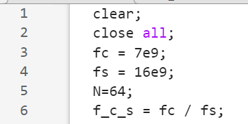

# VMbPWM-ADT

Hi there! Here are the simulation codes and bitstreams of the VMbPWM-based ADT proposed in the work 'Can multi-bit deduction help? A VMbPWM-based ADT towards higher in-band SNRs evolved from VbPWM at the cost of enlarged resource consumption' and the VbPWM-based ADT in the work 'VbPWM-based ADT: An Iterative Deduction Approach Restricting the Traversal of MPWM at the Cost of In-Band SNR' (you can find it at https://ieeexplore.ieee.org/document/10766909). I will show you, step by step, how to perform a simulation or how to implement the proposed ADT in your ZCU102 for a quick evaluation. 

## Run the Simulation

I personally recommend you run the simulation first to have a glance at the VMbPWM-based ADT. Codes are included in ./Simulation, where the ADT_VbMbPWM.m serves as the main entrance of the simulation. For some reason, I cannot give you the original code, instead, I will provide the binary file named '~.mexw64' compiled by the Matlab Coder, thereby you can evaluate the VMbPWM in your own simulation platforms. 

### Preparation

You shall first prepare
- A host PC that could run Matlab R2023b with at least 8 cores and 16 GB of RAM (otherwise I suggest you disable the spmd function in ADT_VbMbPWM.m, where I will show you how to do so a little bit later)

You also need to install the following software:
- Matlab R2023b (other version of Matlab might supports using the compiled MEX file, but I have not tested yet)

### How to run

Running the simulation is quite simple: 
- Open ./Simulation/ADT_VbMbPWM.m with Matlab
- Click Run
- Wait patiently while the code is being executed
- Check the results

### Run under other symbol rates

Symbol rates can be easily changed by assigning different values to $f_{BB}$ on line 10. Please be aware that $f_{IF}$ should be a multiple of $f_{BB}$ so that the upsample function can work properly. 

### Run with different $M$

The mentioned $M$ in the paper, which denotes how many bits are deduced in a single iteration, is set on line 64 as the last parameter of function VbMbPWM_mex. We have tested the function under $M$ being 2, 4, and 8, and you might use the value 16 if you are curious about its performance. 

### Run with the $M$ combination

Another feature provided by the VMbPWM is that the number of deduced bits in each iteration could be different. To use the setup $M=2(24)8(2)$ presented in the paper, simply replace lines 63-64 with 
```
        [out_org,~]=VbMbPWM_228_mex(s,N,f_c,f_s);
        %[out_org,~]=VbMbPWM_mex(s,N,f_c,f_s,8);
```
and run the code. 

### Run with spmd disabled

If you want to disable the spmd function for less memory usage, you shall first comment out line 3 so that
```
%parpool(8);
```
and then replace line 56 to 71 with 
```
%lab_seg_len = floor(length(IF_sym_phaseCorr) / 8);
%spmd
    %current_lab = spmdIndex();
    for current_index = 1:1:length(IF_sym_phaseCorr)
        f_c_in = f_c / 1e6;
        f_s_in = f_s / 1e6;
        s = r .* IF_sym_phaseCorr(current_index);
        % [out_org,~]=VbMbPWM_228_mex(s,N,f_c,f_s);
        [out_org,~]=VbMbPWM_mex(s,N,f_c,f_s,8);
        target_path_org((current_index-1)*N+1:current_index*N) = double(out_org);
    end
end
RF_bin_org = target_path_org;
```
Afterward, you can run the code with the spmd disabled. 

## Download the bitstream

### Preparation

You shall first prepare
- A host PC that could at least run Vivado and Matlab (Windows 11 is recommended, and other OS is not tested for the following procedures),
- A ZCU102 board,
- A Vector Signal Analyzer.

You also need to install the following software: 
- Vivado 2022.2 (or other versions as long as it supports the tcl commands used to configure the VIOs),
- Matlab R2023b (or other versions as long as it supports the function 'dec2hex'),
- ZCU102 System Controller User Interface (you can find it at https://adaptivesupport.amd.com/s/question/0D52E00006iHoSMSA0/find-scui-download-for-zcu102?language=en_US or https://www.xilinx.com/member/forms/download/design-license.html?cid=ac58ab65-c8ed-483c-abe1-891152eb3d95&filename=rdf0382-zcu102-system-controller-c-2018-3.zip)

### Configure the clock frequency

You need to configure the Si570 on ZCU102 to meet the requirements raised by the MMCM and GTH in the bitstream. I will only present the essential steps to configure the clock frequency, as for the detailed instructions, please refer to https://www.xilinx.com/member/forms/download/design-license.html?cid=2bcb43d9-66d4-4a10-8d30-d01defd6b8cf&filename=xtp433-zcu102-system-controller-c-2018-3.pdf. 
- Connect ZCU102 and the host PC
- Power on ZCU102 and open the BoardUI.exe inside the SCUI folder
- Fill in the SN and the MAC address of your board
- Set the Si570 user Frequency to 300 MHz and set the Si570 MGT Frequency to 100 MHz. The boot frequency of Si570 can also be configured using these values if needed. 


- Read the carrier frequency to verify if the Si570 is programmed with the desired frequencies. 

### Program FPGA and configure the register map

After configuring the frequencies, it is time to program the FPGA with the bitstreams inside ./Bitstream: 
- Open vivado and open the hardware target to program the ZCU102 with your desired bit
- After programming, you will see the ila interface in the dashboard. Otherwise, you should check the tcl console to see if everything is correct
- If you program the ZCU102 with the bit whose prefix is VMbPWM: 
  - Open ./VMbADT_initScript/vio_prog_tcl_script_gen.m with Matlab
  - Change the carrier frequency on line 3 to your desired frequency. Please make sure the carrier frequency is a multiple of 250 MHz (I only measure the EVM under such carrier frequencies to ease the verification process and to bypass the phase-compensation unit). 
  
  

  - Replace the file path with your desired locations <your_path>/exp_vec_real_script.tcl and <your_path>/exp_vec_imag_script.tcl on line 14 and line 17

    

  - Run the code, and you will see two files 'exp_vec_imag_script.tcl' and 'exp_vec_real_script.tcl' are generated under <your_path>/ 
  - Copy the init_script.tcl in ./VMbADT_initScript to <your_path>/
  - Open <your_path>/init_script.tcl with your text editor and replace lines 14 and 15 with 

```
source <your_path>/exp_vec_real_script.tcl
source <your_path>/exp_vec_imag_script.tcl
```

- If you program the ZCU102 with the bit whose prefix is VbPWM: 
  - Open ./VbADT_initScript/vio_prog_tcl_script_gen.m with Matlab
  - Change the carrier frequency on line 3 to your desired frequency. Please make sure the carrier frequency is a multiple of 250 MHz (I have removed the compensation unit to create the 100 MHz frequency bias in https://ieeexplore.ieee.org/document/10766909, as this is not that urgent or essential when verifying the performance)
  - Replace the file path with your desired locations on lines 14, 17, 45, and 48 with <your_path>/~.tcl
  - Run the code, and you will see the four files under <your_path>/
  - Copy the init_script/tcl in ./VbADT_initScript/init_script.tcl to <your_path>/
  - Open <your_path>/init_script.tcl with your text editor and replace line 14-17 with 'source <your_path>/~.tcl'
- Now head back to vivado, type
```
source <your_path>/init_script.tcl
```
- Then wait patiently while this command is executed. Then you can switch to your VSA for further evaluation.   
